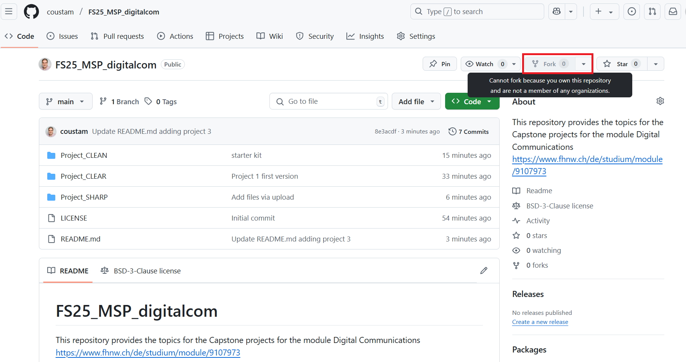

# FS25_MSP_digitalcom
This repository provides the topics for the Capstone projects for the module Digital Communications https://www.fhnw.ch/de/studium/module/9107973

- Project 1 CLEAR: Evaluating Digital Communication Links under Noise and Optimal Reception
- Project 2 CLEAN: Communication Link Estimation & Adaptive Noise-reduction
- Project 3 SHARP: Spectral Handling & Adaptive Rejection of Power
- Project 4 DEFI: Decision-Feedback Equalizer Implementation
- Project 5 KALM : Kalman-based Adaptive Linear Modeling

We’ll cover how to fork the [`FS25_MSP_digitalcom`](https://github.com/coustam/FS25_MSP_digitalcom) repository, make changes, and push them back.

---

## Recommended Tools

We recommend using:
- **[Visual Studio Code (VSCode)](https://code.visualstudio.com/)** for editing and managing your code with a powerful and user-friendly interface.
- **[Jupyter Notebook](https://jupyter.org/)** for interactive data analysis, visualization, and running code snippets, especially if the repository involves Python code and data processing.

You can install VSCode and the Python/Jupyter extensions to work seamlessly.
VSCode Includes a console that you can use 

---

## Step 1: Fork the Repository

1. Go to the [FS25_MSP_digitalcom repository](https://github.com/coustam/FS25_MSP_digitalcom).
2. In the top-right corner, click the `Fork` button.
3. Choose your GitHub account to create a fork. This will create a copy of the repository in your account.



---

## Step 2: Clone the Forked Repository

Next, clone the forked repository to your local machine:

```bash
git clone https://github.com/YOUR_USERNAME/FS25_MSP_digitalcom.git
```
Replace YOUR_USERNAME with your GitHub username.

---
## Step 4: Create a New Branch for Your Work
```bash
 git checkout -b name-experiments
```
---
## Step 4: Edit codeand run you experiments, update your powerpoint

---
## Step 5: Stage and Commit Your Changes, and Final Push
```bash
git checkout -b name-experiments
git add .
git commit -m "Update experiments, code, and presentation slides"
git push origin my-experiments
```
---
